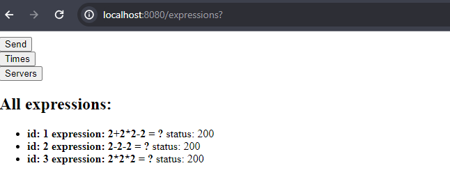
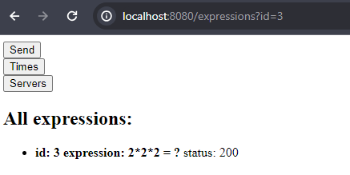
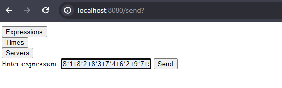
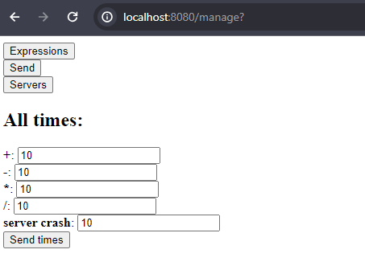
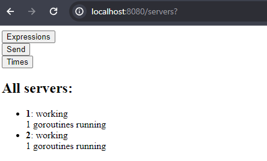

# Распределенный вычислитель арифметических выражений

## 1. Описание микросервиса

Пользователь хочет считать арифметические выражения. Он вводит строку 2 + 2 * 2 и хочет получить в ответ 6. Но наши операции сложения и умножения (также деления и вычитания) выполняются "очень-очень" долго. Поэтому вариант, при котором пользователь делает http-запрос и получает в качетсве ответа результат, невозможна. Более того: вычисление каждой такой операции в нашей "альтернативной реальности" занимает "гигантские" вычислительные мощности. Соответственно, каждое действие мы должны уметь выполнять отдельно и масштабировать эту систему можем добавлением вычислительных мощностей в нашу систему в виде новых "машин". Поэтому пользователь, присылая выражение, получает в ответ идентификатор выражения и может с какой-то периодичностью уточнять у сервера "не посчиталость ли выражение"? Если выражение наконец будет вычислено - то он получит результат.

## 2. Запуск микросервиса

1. Для запуска вам необходимо установить: [Docker Desktop](https://www.docker.com/products/docker-desktop/) и запустить его для возможности тестирования.
2. Запустите терминал и перейдите в директорию проекта.
3. Выполните команду для установки зависимостей:
```
go mod download
```
4. Выполните команду для запуска контейнера базы данных Postgresql:
```
docker-compose up --build -d
```
5. Выполните команду для запуска проекта:
```
go run cmd/main.go
```
6. Перейдите по [ссылке](http://localhost:8080/expressions) для тестирования.

## 3. Логика работы
 Файл ```main.go``` запускает оркестратор и двух агентов. Они являются самостоятельными, то есть их можно запускать отдельно и в разное время. Если один из компонентов упадет, то остальные продолжат работу. В проекте реализован графический интерфейс для тестирования.


<details>
<summary><b> Агенты </b></summary>

Агенты запускаются по-одному с аргументом ```goroutines``` - максимальное количество вычислителей(горутин). При запуске агент записывает себя в базу серверов-вычислителей и сразу начинает работать функция ```pinging()``` - раз в определенный промежуток времени отправляет в базу данных свой пинг. Затем, раз в секунду, если имеются свободные вычислители, агент отправляет ```Get``` запрос выражения оркестратору. Если получает его, то начинает параллельно выполнять. После вычисления он записывает результат в базу данных.
(В проекте реализован мониторинг запущенных вычислителей и статусов самих агнетов)
</details>

<details>
<summary><b> Оркестратор </b></summary>
Оркестратор является веб-приложением: он обрабатывет новые параметры времени(```manage time```) и выражения(```send expression```) и отправляет их в базу данных или берет из нее данные для отображения пользователю. Также оркестратор обрабатывает запросы агентов на новые выражения: он берет из таблицы выражения нерешенные выражения из бд и возвращает агентам, запуская горутину, которая отслеживает, чтобы выражение было решено за выбранное пользователем время. Также на оркестраторе запущена горутина, которая проверяет, что сервера-агенты присылают пинги, иначе оркестратор меняет их статус на ```dead```.
</details>

## 4. Работа сервиса(реализованные функции)

### Микросервис представляет собой 4 старницы:
1. [Expressions](http://localhost:8080/expressions) - показывает список всех выражений, их результат, статус(```200```: правильное выражение, решается/решено; ```400```: невалидное выражение; ```500```: ошибка бекенда) или выводит конкретное выражение по аргументу ```id``` в url.



2. [Send expression](http://localhost:8080/send) - отправка нового выражения пользователя для вычисления. В ответ у пользователя появляется ```id``` его выражения для поиска.



3. [Time manage](http://localhost:8080/manage) - изменение длительности выполнения различных операций или времени ожидания пинга от воркера.



4. [Servers](http://localhost:8080/servers) - отображение всех агентов, статусов их работы, количества работающих вычислителей(воркеров)



## 5. Тестирование
В выражениях можно использовать только операции + - * /. Вводить без знака равенства. Все пробелы удаляются.
Вот несколько рабочих примеров:
```
8*1+8*2+8*3+7*4+6*2+9*7+5*3 = 166
```

```
2*2-2 = 2
```

```
2+2*2-2 = 4
```


## 6. Схема

## 7. Связь с автором
telegram: [@meerphy](https://t.me/meerphy)